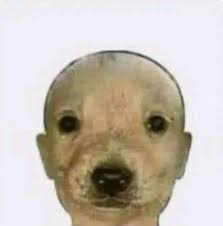
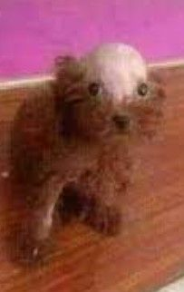

# Tarea-git
tarea git leguaje de marcas
## Juan José Giménez Marín

Texto de ejemplo






`Ejemplo Java`

```java
public class Revolver{
    for(int i; i=10; i++)
}

```
`Ejemplo Python`

```python
animales = ("gato", "perro", "loro", "gato", "hormiga")
print(animales.index("loro")) # Te muestra la posicion

print(animales.count("loro")) # cuenta la cantidad de loros
```

 ## Horario de clase

|horas|lunes|martes|miercoles|jueves|viernes|
|-----|-----|------|---------|------|-------|
|8-9|fol|fol|programacion|programacion|programacion|
|9-10|fol|lenguaje de marcas|lenguaje de marcas|base de datos|programacion|
|10-11|sistemas informaticos|entornos|entornos|base de datos|programacion|
|11-12|base de datos|sistemas informaticos|base de datos|entornos|sistemas infomaticos|
|12-12:30|recreo|recreo|recreo|recreo|recreo|
|12:30-13:30|base de datos|programacion|base de datos|lenguaje de marcas|sistemas informaticos|
|13:30-14:30|programacion|programacion|sistemas informaticos|sistemas informaticos|lenguaje de marcas|


### Lista desordeanada
* uno
* dos
* tres

### Lista Ordenada
1. uno
1. dos
1. tres

[Enlace a pizzeria](https://github.com/K4NK0/Pizzeria)

[Enlace a web pizzeria](https://k4nk0.github.io/Pizzeria/)

[Enlace a informacion](informacion.md) 
[Enlace a instalacion](instalacion.md) 

[google](https://google.es)