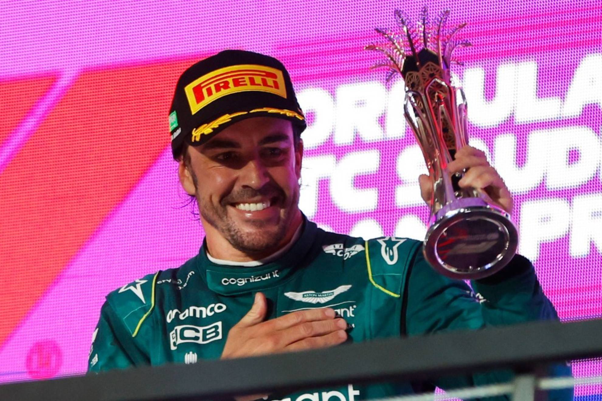
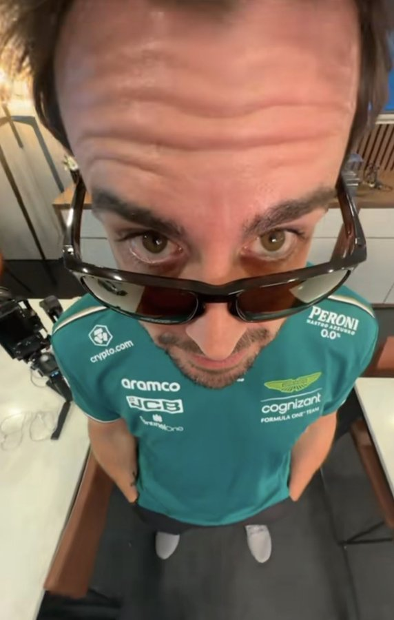

# El nano
Fernando Alonso Díaz (Oviedo, Asturias; 29 de julio de 1981) es un piloto de automovilismo español, galardonado como Premio Príncipe de Asturias en 2005. Ha ganado dos veces el Campeonato Mundial de Fórmula 1 en 2005 y 2006,3​resultó subcampeón en 2010, 2012 y 2013, y obtuvo un tercer puesto en 2007. Fue campeón del Campeonato Mundial de Resistencia de la FIA en 2019, las 24 Horas de Le Mans en 2018 y 2019, las 24 Horas de Daytona de 2019 y el Campeonato Mundial de Karting en 1996.

 

### Informacion sobre Fernando Alonso
* [wikipedia](https://es.wikipedia.org/wiki/Fernando_Alonso)
* [marca](https://www.marca.com/motor/fernando-alonso.html)
* [instagram](https://www.instagram.com/fernandoalo_oficial/?hl=es)
